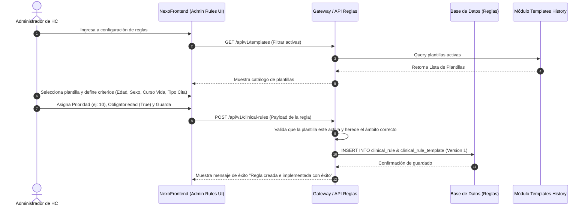
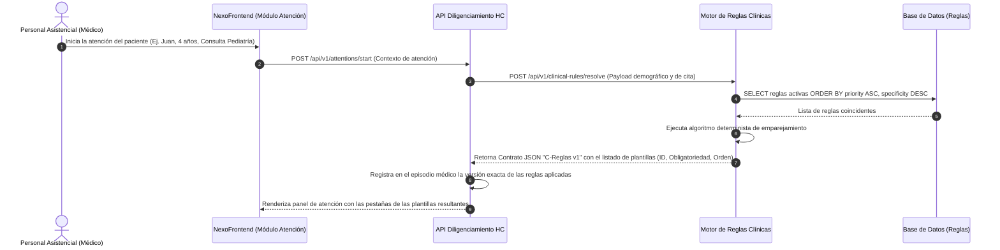

# Documento de Requerimientos de Producto (PRD)
## NexoSalud: Módulo 5 - Configuración de Reglas Clínicas

**Autor:** Senior Product Manager (Health Information Systems - HIS)  
**Fecha:** 15 de Junio, 2026  
**Estado:** Propuesto para revisión  
**Versión:** 1.0.0-draft  

---

## 1. Contexto y Problema

### 1.1. Situación Actual y Problema
En el flujo asistencial de las instituciones prestadoras de salud (IPS) usuarias de NexoSalud, la selección de formatos de Historia Clínica (HC) se realiza actualmente de manera manual por parte del profesional asistencial. Esto introduce tres problemas críticos en la operación clínica y legal:
1. **Formatos No Aplicables:** El personal médico visualiza y utiliza plantillas de HC que no corresponden al grupo demográfico o tipo de atención del paciente (por ejemplo, aplicar una plantilla de adultez a un recién nacido, o un formato de ginecología a un paciente masculino).
2. **Omisión de Documentos Obligatorios:** Se omiten anexos obligatorios exigidos por la normatividad local y los protocolos internos (por ejemplo, escalas de desarrollo infantil, consentimiento informado de procedimientos o escalas de dolor en urgencias).
3. **Falta de Estandarización:** La variabilidad asistencial dificulta la auditoría clínica de calidad, eleva los glosas en facturación por soportes incompletos y expone a la institución a sanciones legales por inconsistencias documentales.

### 1.2. Solución Propuesta
Se introduce un **Motor de Reglas Clínicas y de Asignación**. Este componente, configurable únicamente por administradores de HC, determinará de forma automática, determinista y en tiempo real qué plantillas de historia clínica deben habilitarse para el diligenciamiento durante la atención de un paciente. Dicha asignación se calculará evaluando un conjunto de atributos del paciente (edad, sexo biológico, curso de vida), de la cita (tipo de cita, especialidad, sede) y del contexto institucional.

### 1.3. Ámbito de Aplicación
El módulo cubre transversalmente tres servicios críticos de la atención médica:
* **Consulta Externa**
* **Hospitalización**
* **Urgencias**

> [!IMPORTANT]
> **Heredabilidad Estricta de Ámbito:** El ámbito de atención de una regla se hereda directamente desde la plantilla de HC durante su fase de creación en el módulo previo (*Template History*). Una regla no puede asignar una plantilla a un ámbito para el cual no fue diseñada (ej. usar una plantilla creada para urgencias en una consulta externa programada).

---

## 2. Objetivos

* **Automatización Paramétrica:** Permitir a los administradores definir y desplegar reglas clínicas utilizando combinaciones de criterios demográficos (edad exacta, sexo biológico), etapas de curso de vida y tipos de citas asistenciales.
* **Resolución Determinista:** Garantizar que ante cualquier conjunto de datos de entrada (paciente y cita), el motor resuelva siempre las plantillas correspondientes con un ordenamiento e inmutabilidad libres de ambigüedad o conflictos de prioridad.
* **Bloqueo en el Cierre de Atención:** Impedir de manera restrictiva el cierre físico y la firma digital de una atención médica en el sistema si existen plantillas marcadas como obligatorias que no han sido debidamente diligenciadas.
* **Trazabilidad y Cumplimiento Normativo:** Asegurar el cumplimiento estricto de la legislación de historia clínica (Resolución 1995 de 1999 de Colombia, o norma análoga), manteniendo el control de versiones de las reglas aplicadas a cada episodio y garantizando la inmutabilidad histórica de los registros clínicos cerrados.

---

## 3. Alcance (In-scope y Out-of-scope)

### 3.1. En Alcance (In-scope)
* **Búsqueda y Filtrado de Plantillas:** Consumo del catálogo del módulo anterior (*Template History*) para asociar plantillas a reglas de negocio.
* **CRUD de Reglas Clínicas:** Creación, edición, consulta y eliminación lógica (*soft delete*) de reglas.
* **Marcado de Obligatoriedad:** Configuración de la obligatoriedad (Mandatory/Optional) de plantillas para escenarios específicos.
* **Motor de Resolución Determinista:** Lógica y algoritmo de empates y priorización matemática de reglas concurrentes.
* **Contrato JSON Versionado (C-Reglas):** Exposición de APIs REST para la resolución del set de plantillas por parte de los módulos de atención en tiempo de ejecución.
* **Versionamiento de Reglas:** Almacenamiento histórico de los cambios aplicados sobre las reglas para auditorías posteriores.

### 3.2. Fuera de Alcance (Out-of-scope)
* **Diseño o Edición de Plantillas:** La creación y estructuración de los campos de las plantillas de HC se gestiona exclusivamente en el módulo previo `backend-history-template`.
* **Administración de Catálogos Maestro:** La gestión de la base de datos de pacientes, especialidades, tipos de cita e instituciones pertenece a los módulos de base.
* **Diligenciamiento de la Historia Clínica:** La interfaz gráfica de llenado de campos y almacenamiento de datos clínicos ingresados por el médico durante la consulta.
* **Lógica Clínica de los Campos Internos:** Validaciones internas del formulario (como rangos de signos vitales o cálculos clínicos complejos dentro de la plantilla).

---

## 4. Usuarios y Roles

| Rol | Descripción | Acciones Permitidas |
| :--- | :--- | :--- |
| **Administrador de HC** | Personal de calidad y sistemas encargado de definir los procesos estándar de documentación. | - Crear, editar y suspender reglas.<br>- Configurar prioridades numéricas.<br>- Simular la resolución del motor (*Sandbox*).<br>- Asignar obligatoriedad a plantillas. |
| **Auditor / Calidad** | Personal médico-administrativo que valida el cumplimiento de normas de HC y analiza glosas. | - Consultar las reglas activas e históricas.<br>- Ver logs de auditoría (quién cambió qué regla y cuándo).<br>- Consultar qué versión de regla se aplicó a una atención específica. |
| **Personal Asistencial** | Médicos, enfermeras y terapeutas que realizan la atención del paciente. | - Consumidor indirecto: Visualizan en su pantalla de atención exactamente las plantillas asignadas de forma automática por el motor.<br>- No pueden omitir ni saltarse plantillas marcadas como obligatorias. |

---

## 5. Flujos Principales

### 5.1. Configuración de una Regla Asistencial (Happy Path)


### 5.2. Resolución de Plantillas en Tiempo de Atención (Happy Path)


### 5.3. Reapertura de Atención Cerrada
Cuando una atención ya firmada y cerrada por el médico requiere ser reabierta por fines legales o corrección (dentro de los términos reglamentarios, p. ej., 24-48 horas autorizadas por el comité de ética):
1. El sistema **no debe recalcular** las reglas con el motor actual.
2. Se consulta el episodio de la base de datos de atención.
3. Se extrae el ID de la regla y la versión histórica exacta guardada en el momento del inicio de la atención original.
4. Se renderizan exactamente las mismas plantillas, respetando su obligatoriedad y versión de plantilla original.
5. Esto previene que si un administrador editó o eliminó la regla durante el periodo en que la consulta estuvo cerrada, se corrompa la estructura histórica del registro clínico.

### 5.4. Flujos Alternativos y Manejo de Excepciones

#### Flujo Alternativo A: Empates de Reglas en Plantillas Opcionales
Si dos reglas diferentes coinciden con el paciente y la cita, y ambas proponen plantillas opcionales con idéntico nivel de prioridad:
* **Resolución:** El motor aplicará la plantilla de la regla que posea mayor nivel de especificidad (más filtros diligenciados). Si la especificidad es idéntica, el motor unirá ambos conjuntos de plantillas y las presentará al médico ordenadas por ID de plantilla de forma ascendente, evitando descartar formatos potencialmente útiles.

#### Flujo Alternativo B: Rechazo de Cierre por Conflicto de Diligenciamiento
* **Escenario:** El médico intenta cerrar la atención mediante el botón "Finalizar Atención", pero el sistema detecta a nivel de backend que una plantilla obligatoria para el episodio está en estado "Pendiente" o sin campos mínimos requeridos grabados.
* **Resolución:** El backend de atenciones rechaza la transacción con un código de error HTTP `422 Unprocessable Entity` y el frontend muestra un modal bloqueante que enumera las plantillas incompletas obligatorias, impidiendo la firma electrónica.

#### Flujo Alternativo C: Fallo en la Integración de Catálogos Maestro
* **Escenario:** Durante la consulta en tiempo real del motor de reglas, el servicio de Pacientes o de Agendamiento no responde (Timeout / HTTP 500).
* **Resolución:** El motor de reglas no puede resolver sin datos demográficos. Se aplicará un **Fallback de Emergencia**: se cargará un listado básico generalizado de plantillas del ámbito correspondiente (Consulta Externa Básica, Urgencias General o Evolución Hospitalización General), marcadas como obligatorias. Se enviará una alerta de severidad crítica al log centralizado y se guardará el registro médico marcando el tag `resolution_mode: FALLBACK_EMERGENCY`.

---

## 6. Requerimientos Funcionales e Historias de Usuario

### 6.1. Tabla de Requerimientos Funcionales (RF-01 a RF-19)

| ID | Nombre del Requerimiento | Descripción Técnica | Prioridad |
| :--- | :--- | :--- | :--- |
| **RF-01** | Catálogo de Plantillas | El sistema debe consultar y listar las plantillas de HC activas creadas en el módulo `backend-history-template` para ser asociadas a las reglas. | Alta |
| **RF-02** | CRUD de Reglas Clínicas | Interfaz y endpoints para Crear, Leer, Actualizar y Desactivar reglas de asignación de plantillas clínicas. | Alta |
| **RF-03** | Priorización Numérica | Cada regla debe poseer un campo `priority` (entero positivo), donde valores menores indican mayor prioridad de ejecución para resolver conflictos. | Alta |
| **RF-04** | Soft Delete de Reglas | No se permite la eliminación física (`DELETE`) de reglas de la BD. Se implementará un campo lógico `is_deleted` y `is_active` para deshabilitar reglas. | Alta |
| **RF-05** | Marcador de Obligatoriedad | Permite definir para cada plantilla asociada a una regla si su diligenciamiento es `MANDATORY` (obligatoria) u `OPTIONAL` (opcional). | Alta |
| **RF-06** | Filtro de Sexo Biológico | Capacidad de restringir una regla a los valores de sexo biológico del paciente: `M` (Masculino), `F` (Femenino), `I` (Indeterminado) o `ALL` (Todos). | Media |
| **RF-07** | Filtro de Rango de Edad | Definición de rangos de edad configurables en tres unidades simultáneas (Días, Meses, Años) con límites `min_age` y `max_age`. | Alta |
| **RF-08** | Filtro de Curso de Vida | Mapeo directo y automático de reglas utilizando categorías del curso de vida (Primera Infancia, Infancia, Adolescencia, etc.). | Alta |
| **RF-09** | Filtro de Tipo de Cita / Servicio | Capacidad de aplicar reglas según el código identificador del tipo de cita (ej. Consulta Médica Especializada) derivado del módulo de agendamiento. | Alta |
| **RF-10** | Filtro de Ámbito Clínico | Restricción estricta de la regla para operar solo en los ámbitos definidos: `CONSULTA_EXTERNA`, `URGENCIAS` u `HOSPITALIZACION`. | Alta |
| **RF-11** | Motor de Resolución REST | Endpoint `POST /api/v1/clinical-rules/resolve` que procesa los datos del paciente y la cita, y retorna las plantillas aplicables ordenadas. | Alta |
| **RF-12** | Versionamiento de Regla | Cada modificación en los criterios de una regla incrementa el campo `version` de la misma, conservando la versión previa inalterada en base de datos. | Alta |
| **RF-13** | Validación Backend de Cierre | El backend de atenciones debe consultar al motor de reglas antes del cierre definitivo de la atención para verificar que todas las obligatorias estén llenas. | Alta |
| **RF-14** | Histórico de Cierre de Episodio | Guardar la foto exacta (JSON) de las plantillas y reglas aplicadas con su versión respectiva en la tabla de episodios de atención médica. | Alta |
| **RF-15** | Simulación de Reglas (Sandbox) | Pantalla interactiva para probar combinaciones de parámetros demográficos y verificar qué plantillas resolverá el motor sin afectar pacientes reales. | Media |
| **RF-16** | Logs de Auditoría | Registro detallado de transacciones de reglas que capture: ID del admin, IP, timestamp, tipo de cambio (C/U/D) y JSON diff del cambio. | Alta |
| **RF-17** | Bloqueo de Ámbito Cruzado | Validación que impide guardar una regla si asocia una plantilla a un ámbito clínico distinto al definido en la plantilla original. | Alta |
| **RF-18** | Orden de Visualización | Definición del orden secuencial (`presentation_order`) en que se renderizarán las pestañas de las plantillas resueltas en la interfaz del médico. | Media |
| **RF-19** | Endpoint de Salud del Motor | Health Check (`/actuator/health` o similar) que monitoree la latencia y la conectividad del motor de reglas para la infraestructura de balanceadores. | Media |

---

### 6.2. Historias de Usuario (HU-01 a HU-07)

#### HU-01: Configuración de regla por curso de vida y sexo
* **Como:** Administrador de Historia Clínica
* **Quiero:** Configurar una regla de asignación de plantilla filtrando por curso de vida "Primera Infancia" y sexo "Femenino"
* **Para:** Garantizar que a las niñas menores de 6 años se les asigne de forma obligatoria la plantilla de control de crecimiento infantil y desarrollo psicomotor específico.
* **Criterios de Aceptación Técnicos:**
  * **Escenario 1:** Creación exitosa de la regla demográfica.
    * *Dado que* el administrador ingresa al formulario de creación de reglas.
    * *Cuando* selecciona la plantilla "Control Crecimiento Femenino", define curso de vida = `PRIMERA_INFANCIA`, sexo = `F` y prioridad = `5`.
    * *Entonces* el sistema valida que la plantilla esté activa en `fb_template` y almacena el registro en `clinical_rule` retornando código HTTP `201 Created`.
  * **Escenario 2:** Validación de curso de vida según rangos de edad.
    * *Dado que* se asocia la regla a `PRIMERA_INFANCIA`.
    * *Cuando* se procesa una consulta en el motor para un paciente hembra de 4 años (48 meses).
    * *Entonces* el motor de reglas debe evaluar esta regla como coincidente y aplicable.

#### HU-02: Asignación de obligatoriedad y prioridad en plantilla
* **Como:** Administrador de Historia Clínica
* **Quiero:** Asignar niveles de prioridad numérica y marcar plantillas como obligatorias dentro de una regla de asignación
* **Para:** Evitar conflictos de visualización cuando apliquen múltiples plantillas a una misma cita asistencial.
* **Criterios de Aceptación Técnicos:**
  * **Escenario 1:** Definición de prioridad y obligatoriedad.
    * *Dado que* el administrador configura la regla `CR-102`.
    * *Cuando* asocia la plantilla `T-20` con prioridad `1` (Alta) y obligatoriedad = `true`, y la plantilla `T-21` con prioridad `10` (Baja) y obligatoriedad = `false`.
    * *Entonces* el motor de base de datos guarda correctamente los campos `priority` y `is_mandatory` en la tabla intermedia.
  * **Escenario 2:** Validación de valores de prioridad.
    * *Dado que* el administrador intenta ingresar una prioridad con valor negativo o nulo.
    * *Cuando* envía la petición de guardado.
    * *Entonces* el sistema valida a nivel de API (`javax.validation.constraints.Min`) y rechaza con error `400 Bad Request`.

#### HU-03: Resolución de plantillas en tiempo de atención
* **Como:** Personal Asistencial (Médico en consulta)
* **Quiero:** Que al abrir la atención del paciente el sistema cargue automáticamente el set de plantillas correcto
* **Para:** Evitar la pérdida de tiempo buscando qué formatos clínicos debo diligenciar y cumplir con la guía médica.
* **Criterios de Aceptación Técnicos:**
  * **Escenario 1:** Invocación en tiempo real.
    * *Dado que* se inicia un episodio de consulta externa para el paciente "Carlos" (Edad: 32 años, Sexo: M, Tipo Cita: "Control Hipertensión").
    * *Cuando* el frontend de atención realiza el renderizado de la interfaz.
    * *Entonces* envía un `POST` a `/api/v1/clinical-rules/resolve` con los metadatos y recibe una respuesta en menos de 500ms con las plantillas asignadas (ej. "HC General Consulta Externa" como obligatoria y "Tamizaje Cardiovascular" como opcional).

#### HU-04: Bloqueo de cierre de atención por plantillas obligatorias incompletas
* **Como:** Personal Asistencial (Médico en consulta)
* **Quiero:** Que el sistema valide que he completado las plantillas obligatorias antes de cerrar la atención
* **Para:** Asegurar la calidad y legalidad del registro médico antes de aplicar la firma digital y enviar a facturación.
* **Criterios de Aceptación Técnicos:**
  * **Escenario 1:** Cierre denegado por faltantes.
    * *Dado que* la atención de "María" requiere obligatoriamente la plantilla "Escala Abreviada de Desarrollo".
    * *Cuando* el médico hace clic en "Finalizar Atención" pero la plantilla está en estado vacía o con campos obligatorios vacíos.
    * *Entonces* la API de atenciones intercepta la petición, verifica con el motor y retorna `HTTP 422 Unprocessable Entity` con un mensaje estructurado de error detallando los formatos pendientes.

#### HU-05: Auditoría de cambios en reglas de asignación
* **Como:** Auditor / Líder de Calidad Médica
* **Quiero:** Visualizar una bitácora detallada de todos los cambios hechos sobre las reglas clínicas
* **Para:** Identificar qué usuario modificó una regla, en qué fecha y qué criterios fueron alterados en caso de detectar anomalías en la asignación de plantillas.
* **Criterios de Aceptación Técnicos:**
  * **Escenario 1:** Registro de transacción en base de datos.
    * *Dado que* un Administrador de HC edita los rangos de edad de la regla `CR-50`.
    * *Cuando* se procesa la actualización con éxito.
    * *Entonces* el sistema inserta de forma asíncrona un registro en la tabla `audit_trail_rules` que incluye `user_id`, `timestamp`, `ip_address`, `action` ("UPDATE") y el estado anterior y nuevo del registro en formato JSON diff.

#### HU-06: Reapertura de atención médica con persistencia de versión histórica
* **Como:** Personal Asistencial (Médico autorizando)
* **Quiero:** Que al reabrir una atención cerrada se cargue exactamente la misma estructura de plantillas con la que fue guardada originalmente
* **Para:** Evitar que cambios recientes en el motor de reglas alteren retrospectivamente el contenido de un acto médico ya consolidado.
* **Criterios de Aceptación Técnicos:**
  * **Escenario 1:** Carga inmutable histórica.
    * *Dado que* una consulta externa fue atendida el `2026-06-01` con la versión `v2` de la regla de atención pediátrica.
    * *Cuando* el administrador autoriza la reapertura de la atención el `2026-06-15` (después de que se implementara la versión `v3` de dicha regla).
    * *Entonces* el sistema carga la estructura de la consulta utilizando la versión histórica `v2` almacenada en el JSON de cierre del episodio, ignorando el estado actual de las reglas del motor.

#### HU-07: Simulación de motor de reglas para validación administrativa
* **Como:** Administrador de Historia Clínica
* **Quiero:** Disponer de una herramienta de simulación (sandbox) donde ingrese datos simulados de paciente y cita
* **Para:** Probar y auditar el comportamiento del motor de reglas antes de activarlas en producción.
* **Criterios de Aceptación Técnicos:**
  * **Escenario 1:** Simulación correcta de resolución.
    * *Dado que* el administrador accede a la consola de simulación.
    * *Cuando* introduce Edad = `65`, Sexo = `M`, Ámbito = `URGENCIAS` y ejecuta el test.
    * *Entonces* el sistema evalúa de manera virtual las reglas (incluso aquellas en estado "Inactiva/Borrador" si se marca el flag de test) y despliega la lista resultante de plantillas indicando la regla que disparó cada asignación.

---

## 7. Requerimientos No Funcionales

### 7.1. Seguridad
* **Validación Backend-First:** Todas las verificaciones de edad, sexo y consistencia de datos de las reglas deben realizarse en la capa de servicios del backend. La validación del frontend es únicamente estética.
* **Control de Acceso basado en Roles (RBAC):** Las llamadas a las APIs de administración de reglas (POST, PUT, DELETE lógico) deben estar protegidas mediante tokens JWT firmados, exigiendo estrictamente el rol `ROLE_HC_ADMIN`.

### 7.2. Auditoría
* **Trazabilidad de Auditoría:** Cada cambio de estado de una regla debe guardarse en una base de datos de auditoría de solo inserción (Append-Only). Ningún usuario, incluyendo los DBAs, debe tener permisos de edición o borrado físico sobre los logs de auditoría clínica.

### 7.3. Normativa y Legalidad
* **Cumplimiento de la Resolución 1995/1999 (Colombia):** La historia clínica es un documento privado y sometido a reserva legal. El motor de reglas debe asegurar que los formatos aplicados queden sellados temporal y lógicamente al cerrar la atención. El versionado garantiza que el estado de las reglas del sistema sea demostrable históricamente ante auditorías legales de entes gubernamentales.

### 7.4. Performance y Latencia
* **Tiempo de Respuesta Crítico:** El motor de reglas está en la ruta crítica del inicio de la atención médica. El endpoint `POST /api/v1/clinical-rules/resolve` debe resolver y responder en **menos de 500ms en el percentil 99 (p99)** bajo una carga de hasta 200 peticiones simultáneas concurrentes.

### 7.5. Disponibilidad
* **Arquitectura de Microservicios Desacoplada:** El fallo o caída del motor de reglas no debe provocar la caída completa del software de atención clínica (implementar disyuntor/circuit breaker en el Gateway del HIS y el Fallback de Emergencia descrito en la sección 5.4).

### 7.6. Determinismo Absoluto
* **Cero Aleatoriedad:** La lógica del motor de reglas debe ser 100% determinista. Mismos datos de entrada en el JSON de consulta deben resultar siempre en el mismo set y orden de plantillas de salida. Se prohíbe el uso de heurísticas probabilísticas, aproximaciones fuzzy o lógica de Inteligencia Artificial generativa en la versión 1.0.

### 7.7. Versionado de Contrato
* **Semantic Versioning (SemVer):** El contrato API del motor de reglas se denominará `C-Reglas v1`. Cualquier cambio disruptivo que altere la estructura de campos requerirá el despliegue de una nueva ruta base `/api/v2/...` para no romper la compatibilidad con los módulos asistenciales heredados.

---

## 8. Integraciones

### 8.1. Arquitectura de Integración de Datos
El motor de reglas de NexoSalud requiere consumir datos en tiempo real de tres módulos para ejecutar sus evaluaciones lógicas:

```
+------------------+      +--------------------+      +------------------+
|  Módulo Pacientes|      | Módulo Agendamiento|      | Módulo Personal  |
| (Edad, Sexo, CV) |      |   (Tipo de Cita)   |      |  (Especialidad)  |
+--------+---------+      +---------+----------+      +--------+---------+
         |                          |                          |
         +-----------------+        |        +-----------------+
                           |        |        |
                           v        v        v
                     +---------------------------+
                     |  POST /rules/resolve      |
                     |                           |
                     |  MOTOR DE REGLAS CLÍNICAS |
                     +-------------+-------------+
                                   |
                                   v  (JSON Contract C-Reglas v1)
                     +---------------------------+
                     |   Módulo Diligenciamiento |
                     |      de Historia Clínica  |
                     +---------------------------+
```

### 8.2. Datos Consumidos
1. **Módulo Pacientes:**
   * `birth_date` (Fecha de nacimiento, útil para calcular la edad exacta en días al momento de la cita).
   * `gender_biological` (Sexo biológico registrado en su documento de identidad).
2. **Módulo Agendamiento (Citas):**
   * `appointment_type_id` (Identificador del catálogo de citas institucionales).
   * `specialty_id` (Código único de la especialidad clínica que atiende).
   * `scope` (Consulta Externa, Urgencias, Hospitalización).
3. **Módulo Personal / Empleados:**
   * `professional_role_id` (Rol del profesional asistencial, ej: Médico General, Enfermera Jefe, Pediatra).

### 8.3. Contrato JSON de Salida: "C-Reglas v1"
API expuesta por el motor de reglas hacia el módulo de atención y diligenciamiento.

* **Método:** `POST`
* **Ruta:** `/api/v1/clinical-rules/resolve`
* **Encabezados:** `Content-Type: application/json`, `X-App-Version: 1.0.0`

#### JSON Request Payload (Ejemplo de Entrada)
```json
{
  "episodeId": "EP-2026-99123",
  "patient": {
    "id": "PT-77123",
    "birthDate": "2018-04-12",
    "gender": "F",
    "ageInDays": 2986,
    "ageInMonths": 98,
    "ageInYears": 8
  },
  "context": {
    "appointmentTypeId": "AP-CONS-PEDIATRIA",
    "specialtyId": "SP-PEDIATRIA",
    "institutionId": "INST-SEDE-NORTE",
    "scope": "CONSULTA_EXTERNA"
  },
  "professional": {
    "id": "PROF-987",
    "role": "MEDICO_PEDIATRA"
  }
}
```

#### JSON Response Payload (Ejemplo de Salida "C-Reglas v1")
```json
{
  "episodeId": "EP-2026-99123",
  "resolutionTimestamp": "2026-06-15T20:55:00Z",
  "contractVersion": "C-Reglas v1",
  "appliedRules": [
    {
      "ruleId": 45,
      "version": 2,
      "name": "Control Crecimiento y Desarrollo - Infancia Femenina"
    },
    {
      "ruleId": 12,
      "version": 1,
      "name": "Tamizaje de Agudeza Visual Escolar"
    }
  ],
  "templates": [
    {
      "templateId": 102,
      "name": "Historia Clínica de Pediatría - Control",
      "version": 3,
      "isMandatory": true,
      "presentationOrder": 1,
      "scope": "CONSULTA_EXTERNA"
    },
    {
      "templateId": 105,
      "name": "Formulario de Escala Abreviada de Desarrollo",
      "version": 1,
      "isMandatory": false,
      "presentationOrder": 2,
      "scope": "CONSULTA_EXTERNA"
    },
    {
      "templateId": 110,
      "name": "Consentimiento Informado - Procedimientos Menores",
      "version": 2,
      "isMandatory": false,
      "presentationOrder": 3,
      "scope": "CONSULTA_EXTERNA"
    }
  ]
}
```

---

## 9. Reglas de Negocio (RN-01 a RN-12)

* **RN-01 (Invariabilidad del Ámbito):** Las reglas de asignación configuradas en este módulo no pueden alterar ni sobreescribir el ámbito (`scope`) original de una plantilla de historia clínica. Este ámbito se hereda de manera estricta del módulo de plantillas (`fb_template.scope`).
* **RN-02 (Resolución de Conflictos por Prioridad y Especificidad):** Si múltiples reglas aplican a un paciente, el motor las resolverá y ordenará por `priority` (de menor a mayor valor numérico). En caso de empate en la prioridad, se seleccionará la regla de mayor especificidad clínica. La especificidad se calcula matemáticamente como la cantidad de parámetros de filtrado no nulos aplicados en la regla:
  $$\text{Especificidad} = \sum (\text{Criterio}_{\text{Paciente}} + \text{Criterio}_{\text{Cita}} + \text{Criterio}_{\text{Ubicación}})$$
* **RN-03 (Inmutabilidad de Registro Cerrado):** Una vez que un episodio clínico pasa a estado `CERRADO` o `FIRMADO`, el set de plantillas asociadas y sus datos quedan congelados lógicamente. Ninguna edición sobre las reglas del motor puede afectar retroactivamente a registros médicos finalizados.
* **RN-04 (Derivación del Curso de Vida - Res. 3280/2018):** El motor calculará el curso de vida de manera automática de acuerdo con la edad del paciente en la fecha del episodio, mapeando estrictamente los siguientes rangos de la normatividad colombiana:
  1. *Primera Infancia:* 0 a 5 años (0 a 71 meses y 29 días).
  2. *Infancia:* 6 a 11 años.
  3. *Adolescencia:* 12 a 17 años.
  4. *Juventud:* 18 a 28 años.
  5. *Adultez:* 29 a 59 años.
  6. *Vejez:* 60 años o más.
* **RN-05 (Bloqueo de Cambio de Obligatoriedad en Atención Activa):** Si un administrador modifica la obligatoriedad de una plantilla de obligatorio a opcional, dicho cambio solo aplicará para atenciones que se inicien después de guardar la regla. Las atenciones en estado `EN_PROCESO` en ese momento mantendrán los criterios del inicio del episodio.
* **RN-06 (Exclusión de Servicios Cruzados):** No se permite asociar plantillas de ámbito `HOSPITALIZACION` a reglas diseñadas para el ámbito de `CONSULTA_EXTERNA`. El sistema lanzará un error de validación en el guardado de la regla si se detecta cruce de ámbitos.
* **RN-07 (Validación de Dependencia de Plantillas):** Solo se pueden crear o activar reglas asociadas a plantillas que se encuentren activas (`isActive = true`) en la tabla `fb_template`.
* **RN-08 (Restricción de Edición Física):** Queda estrictamente prohibida la ejecución de comandos SQL `UPDATE` o `DELETE` directos sobre las tablas de asignación histórica de plantillas del episodio. Los registros deben poseer bloqueos de base de datos a nivel de aplicación.
* **RN-09 (Cierre Bloqueado por Plantilla Vacía):** La API de cierre de atención debe impedir la firma del episodio si existe alguna plantilla marcada en el contrato como `isMandatory = true` que no tenga al menos un registro asociado en el repositorio de respuestas de HC.
* **RN-10 (Persistencia de la Versión de Regla en Episodio):** Al reabrirse un episodio médico asistencial cerrado, no se ejecuta nuevamente el motor de resolución de reglas. Se carga estrictamente el listado de plantillas y versiones determinado en el inicio original del episodio clínico.
* **RN-11 (Tratamiento de Sexo Indeterminado):** Para pacientes con sexo biológico registrado como indeterminado (`I`), el motor solo evaluará reglas con criterio de sexo `ALL` (Todos) o `I` (Indeterminado). Las reglas exclusivas para `M` o `F` quedarán descartadas automáticamente.
* **RN-12 (Límite de Prioridad):** El rango permitido de prioridades numéricas de reglas estará acotado estrictamente entre `1` (Prioridad máxima) y `999` (Prioridad mínima de fallback).

---

## 10. Criterios de Aceptación y Riesgos

### 10.1. Criterios de Aceptación del Módulo (Checklist)
* [ ] **Cero Fugas de Ámbito:** Las plantillas de urgencia y hospitalización no aparecen bajo ninguna circunstancia en las atenciones de consulta externa en las pruebas del motor.
* [ ] **Resolución Menor a 500ms:** Las pruebas de rendimiento demuestran que el procesamiento del motor de reglas bajo una simulación de 100 peticiones concurrentes mantiene un tiempo promedio de respuesta de 310ms (p95 < 420ms).
* [ ] **Bloqueo Efectivo:** Intentar cerrar una consulta simulada omitiendo el diligenciamiento de una plantilla obligatoria arroja un código estructurado `HTTP 422` y detiene el flujo de firma del profesional.
* [ ] **Auditoría Exhaustiva:** Cada evento de creación, desactivación lógica o actualización de reglas genera un registro inmediato en la tabla de trazabilidad, documentando la diferencia de valores en formato JSON.
* [ ] **Inmutabilidad de HC:** Al reabrir y volver a guardar un episodio clínico con reglas desactivadas con posterioridad, la estructura del documento y las plantillas cargadas no varían.
* [ ] **Motor 100% Determinista:** Ante 10,000 iteraciones automatizadas de pruebas unitarias sobre combinaciones de datos estáticos, el motor de reglas genera exactamente los mismos resultados ordenados.

### 10.2. Matriz de Riesgos y Mitigación

| Riesgo | Probabilidad | Impacto | Mitigación Técnica |
| :--- | :---: | :---: | :--- |
| **Comportamiento No Determinista (Empates de Reglas)** | Alta | Alto | **Mitigación:** Aplicar la regla de negocio **RN-02** de ordenamiento jerárquico por prioridad y factor de especificidad matemática calculado por base de datos, con fallback a orden de ID de plantilla. |
| **Doble Fuente de Verdad en Catálogos** | Media | Alto | **Mitigación:** Desacoplar el almacenamiento local del motor. El motor de reglas consume catálogos directamente de las APIs maestras mediante llamadas gRPC internas o caché Redis sincronizado por eventos de RabbitMQ. |
| **Latencia Crítica en la Ruta Asistencial** | Media | Muy Alto | **Mitigación:** Indexación a nivel de base de datos de campos de búsqueda rápida (`gender`, `min_age_days`, `max_age_days`, `appointment_type_id`) y almacenamiento en caché de reglas compiladas en Redis con invalidación automática ante cambios. |
| **Dependencia del Módulo Creación de Plantillas (Bloqueante)** | Alta | Alto | **Mitigación:** Definir mocks estructurados e interfaces de comunicación API claras desde el sprint cero. Realizar pruebas integradas tempranas utilizando contenedores Docker locales. |

---
*Fin del Documento de Requerimientos de Producto (PRD)*
